# Anatomy of Inference Serving
### A Comprehensive Whitepaper on Aggregated/Disaggregated Configurations, Hardware Frontiers, and the Science of LLM Serving at Scale

---

**Version:** 1.0   May 2026  
**Focus Areas:** Prefill/Decode Disaggregation · GB200 / H200 / H100 Architectures · MoE & Dense Models · KV Cache Engineering · Production Serving Stacks

---

## Table of Contents

1. [Executive Summary](#1-executive-summary)
2. [The Anatomy of LLM Inference](#2-the-anatomy-of-llm-inference)
   - 2.1 [Prefill Phase](#21-prefill-phase)
   - 2.2 [Decode Phase](#22-decode-phase)
   - 2.3 [The Compute-Memory Duality](#23-the-compute-memory-duality)
3. [Aggregated vs. Disaggregated Serving Configurations](#3-aggregated-vs-disaggregated-serving-configurations)
   - 3.1 [Aggregated (Coupled) Architecture](#31-aggregated-coupled-architecture)
   - 3.2 [Disaggregated (PD-Split) Architecture](#32-disaggregated-pd-split-architecture)
   - 3.3 [Configuration Trade-offs and Learnings](#33-configuration-trade-offs-and-learnings)
   - 3.4 [KV Cache Migration in Disaggregated Systems](#34-kv-cache-migration-in-disaggregated-systems)
4. [Hardware Landscape](#4-hardware-landscape)
   - 4.1 [NVIDIA H100 SXM5 — The Current Standard](#41-nvidia-h100-sxm5--the-current-standard)
   - 4.2 [NVIDIA H200 — HBM3e and Memory Bandwidth Leap](#42-nvidia-h200--hbm3e-and-memory-bandwidth-leap)
   - 4.3 [NVIDIA GB200 NVL72 — The Grace Blackwell Superchip](#43-nvidia-gb200-nvl72--the-grace-blackwell-superchip)
   - 4.4 [Interconnect: NVLink, NVSwitch, and Infiniband](#44-interconnect-nvlink-nvswitch-and-infiniband)
   - 4.5 [AMD MI300X — The Challenger](#45-amd-mi300x--the-challenger)
5. [Model Architectures Under the Serving Lens](#5-model-architectures-under-the-serving-lens)
   - 5.1 [Dense Transformer Models](#51-dense-transformer-models)
   - 5.2 [Mixture-of-Experts (MoE) Models](#52-mixture-of-experts-moe-models)
   - 5.3 [MoE Serving: Expert Parallelism and Load Balancing](#53-moe-serving-expert-parallelism-and-load-balancing)
   - 5.4 [Multimodal and Multimodal-MoE Models](#54-multimodal-and-multimodal-moe-models)
6. [KV Cache: The Central Resource](#6-kv-cache-the-central-resource)
   - 6.1 [PagedAttention and the Virtual Memory Analogy](#61-pagedattention-and-the-virtual-memory-analogy)
   - 6.2 [Prefix Caching and RadixAttention](#62-prefix-caching-and-radixattention)
   - 6.3 [vTensor: Virtual Memory-Based KV Management](#63-vtensor-virtual-memory-based-kv-management)
   - 6.4 [GQA, MQA, and KV Cache Reduction](#64-gqa-mqa-and-kv-cache-reduction)
7. [KV Cache Transfer and Distribution](#7-kv-cache-transfer-and-distribution)
   - 7.1 [LMCache: The KV Cache Layer](#71-lmcache-the-kv-cache-layer)
   - 7.2 [Mooncake: Kimi's Serving Platform](#72-mooncake-kimis-serving-platform)
8. [Attention Kernel Engineering](#8-attention-kernel-engineering)
   - 8.1 [FlashAttention Evolution: FA1 → FA2 → FA3](#81-flashattention-evolution-fa1--fa2--fa3)
   - 8.2 [FlashInfer: Customizable Attention Engine](#82-flashinfer-customizable-attention-engine)
   - 8.3 [Block-Sparse Formats and Composable Attention](#83-block-sparse-formats-and-composable-attention)
   - 8.4 [Load-Balanced Dynamic Scheduling](#84-load-balanced-dynamic-scheduling)
9. [Serving Engine Deep Dives](#9-serving-engine-deep-dives)
   - 9.1 [vLLM — The Reference Implementation](#91-vllm--the-reference-implementation)
   - 9.2 [SGLang — The Throughput Leader](#92-sglang--the-throughput-leader)
   - 9.3 [NVIDIA TensorRT-LLM — Maximum Performance](#93-nvidia-tensorrt-llm--maximum-performance)
   - 9.4 [llama.cpp — Portability Champion](#94-llamacpp--portability-champion)
   - 9.5 [Triton Inference Server — Enterprise Orchestration](#95-triton-inference-server--enterprise-orchestration)
   - 9.6 [Ray Serve — Distributed Serving Control Plane](#96-ray-serve--distributed-serving-control-plane)
   - 9.7 [KubeAI — Kubernetes-Native Serving](#97-kubeai--kubernetes-native-serving)
10. [Scheduling, Batching, and Control Plane Design](#10-scheduling-batching-and-control-plane-design)
    - 10.1 [Continuous Batching (Orca)](#101-continuous-batching-orca)
    - 10.2 [Chunked Prefill and Stall Reduction](#102-chunked-prefill-and-stall-reduction)
    - 10.3 [Speculative Decoding](#103-speculative-decoding)
    - 10.4 [CPU-Free Inference: Blink Architecture](#104-cpu-free-inference-blink-architecture)
11. [Parallelism Strategies](#11-parallelism-strategies)
    - 11.1 [Tensor Parallelism (TP)](#111-tensor-parallelism-tp)
    - 11.2 [Pipeline Parallelism (PP)](#112-pipeline-parallelism-pp)
    - 11.3 [Expert Parallelism (EP) for MoE](#113-expert-parallelism-ep-for-moe)
    - 11.4 [Sequence and Context Parallelism](#114-sequence-and-context-parallelism)
    - 11.5 [Data Parallelism (DP)](#115-data-parallelism-dp)
12. [Quantization and Precision](#12-quantization-and-precision)
    - 12.1 [FP8 Quantization on H100/H200](#121-fp8-quantization-on-h100h200)
    - 12.2 [FP4 on GB200 Blackwell](#122-fp4-on-gb200-blackwell)
    - 12.3 [INT4/GPTQ/AWQ and Weight-Only Quantization](#123-int4gptqawq-and-weight-only-quantization)
    - 12.4 [GGUF and k-Quants for Edge Inference](#124-gguf-and-k-quants-for-edge-inference)
13. [Production Performance Benchmarks](#13-production-performance-benchmarks)
    - 13.1 [H100 Throughput Comparison (2026)](#131-h100-throughput-comparison-2026)
    - 13.2 [Latency Metrics: TTFT, TPOT, ITL](#132-latency-metrics-ttft-tpot-itl)
    - 13.3 [MoE vs Dense Model Performance Profiles](#133-moe-vs-dense-model-performance-profiles)
    - 13.4 [Impact of CPU Interference (vLLM Colocation Study)](#134-impact-of-cpu-interference-vllm-colocation-study)
14. [Ecosystem Trends and Convergence (2026)](#14-ecosystem-trends-and-convergence-2026)
15. [Future Directions](#15-future-directions)
16. [References and Sources](#16-references-and-sources)

---

## 1. Executive Summary

The deployment of large language models (LLMs) at production scale has transformed from a research curiosity into the defining infrastructure challenge of the current AI era. Every organization serving LLMs at scale from frontier labs to enterprise deployments must navigate a growing matrix of hardware choices, serving architectures, model configurations, and optimization strategies.

This whitepaper dissects the **anatomy of inference serving** across four critical dimensions:

**1. Configuration Architecture.** We examine the fundamental split between *aggregated* (Agg) serving where prefill and decode run on the same GPU pool and *disaggregated* (PD-Split or Disagg) serving where prefill and decode are separated into dedicated pools. This architectural choice has profound implications for utilization, latency, throughput, and hardware cost, and has become the primary differentiation axis among leading serving frameworks in 2026.

**2. Hardware Frontiers.** We profile the current generation of inference accelerators: NVIDIA H100 (the production workhorse), H200 (the memory-bandwidth optimized variant), and GB200/B200 (the Blackwell architecture with native FP4 support and dramatically expanded NVLink connectivity). We analyze how these hardware differences change optimal serving configurations and which model classes benefit most from each.

**3. Model Architectures.** We contrast serving characteristics for dense transformer models (Llama 3, Phi-4, Qwen-3) against Mixture-of-Experts (MoE) models (Mixtral, DeepSeek-V3, Qwen-3-MoE), covering expert routing overhead, activation sparsity exploitation, and the expert parallelism strategies required at scale.

**4. Framework Ecosystem.** We survey the open-source inference stack in depth vLLM, SGLang, TensorRT-LLM, llama.cpp, FlashInfer, LMCache, Mooncake, Ray Serve, KubeAI, and Triton Inference Server covering their design philosophies, performance characteristics, and operational trade-offs.

**Key findings as of May 2026:**

- Disaggregated prefill/decode is transitioning from experimental to production-grade, with SGLang, vLLM, and AI-Dynamo all shipping stable implementations
- GB200 NVL72 changes the multi-GPU calculus fundamentally: 72 GPUs with NVLink bandwidth equivalent to a single high-BW node enables tensor parallelism at scales previously requiring custom interconnects
- MoE models are now the dominant architecture for frontier models, but their serving requires specialized expert parallelism and load balancing that dense-model frameworks handle poorly by default
- The CPU remains the silent latency killer in most serving deployments; research like Blink demonstrates 8× TTFT improvements by removing the CPU from the critical inference path entirely
- FP4 quantization on Blackwell delivers near-FP16 quality at 2× the throughput, reshaping the cost/quality frontier

---

## 2. The Anatomy of LLM Inference

### 2.1 Prefill Phase

The **prefill phase** (also called prompt processing or context encoding) takes the entire input sequence and processes it in a single forward pass to produce the first output token and populate the KV cache.

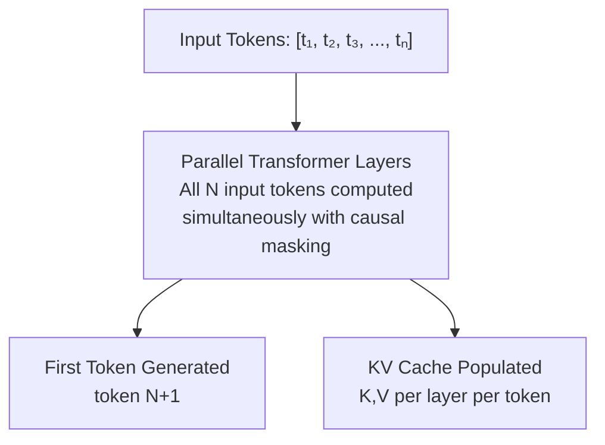

**Computational characteristics of prefill:**

- **Compute-bound**: The attention operation scales as O(n²) with sequence length n. For long contexts, GEMM operations dominate.
- **High arithmetic intensity**: Many tokens processed simultaneously means GPU tensor cores are well-utilized.
- **One-shot**: Prefill happens once per request; duration scales with input length.
- **TTFT-critical**: Time-to-First-Token (TTFT) is entirely determined by prefill latency.

For a model with `L` layers, `H` attention heads, `D` head dimension, and input sequence length `n`:
- KV cache size per request = `2 × L × H × D × n × dtype_size`
- Prefill FLOPs ≈ `2 × n² × H × D + 2 × n × D_model × D_FFN × L`

### 2.2 Decode Phase

The **decode phase** generates output tokens one at a time (or in speculative batches), with each step taking the last generated token and the accumulated KV cache as input.

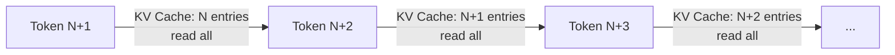

**Computational characteristics of decode:**

- **Memory-bandwidth-bound**: Each decode step reads the entire KV cache for all past tokens but only computes attention for 1 new query token. Operational intensity is O(1) per token (proportional to KV length).
- **Sequential**: Each token depends on the previous, limiting parallelism across the output sequence.
- **Batch-sensitive**: Batching multiple requests together is the primary mechanism to improve GPU utilization during decode.
- **TPOT-critical**: Time-Per-Output-Token (TPOT) is determined by decode step duration.

For a single decode step with batch size `B` and KV length `s`:
- Attention reads: `2 × L × B × s × H × D × dtype_size` bytes
- Attention FLOPs: `2 × B × s × H × D` per layer
- Arithmetic intensity: `~1 FLOP/byte` (heavily bandwidth-limited)

### 2.3 The Compute-Memory Duality

This fundamental asymmetry between prefill (compute-bound) and decode (memory-bound) is the root cause of most serving architecture decisions:

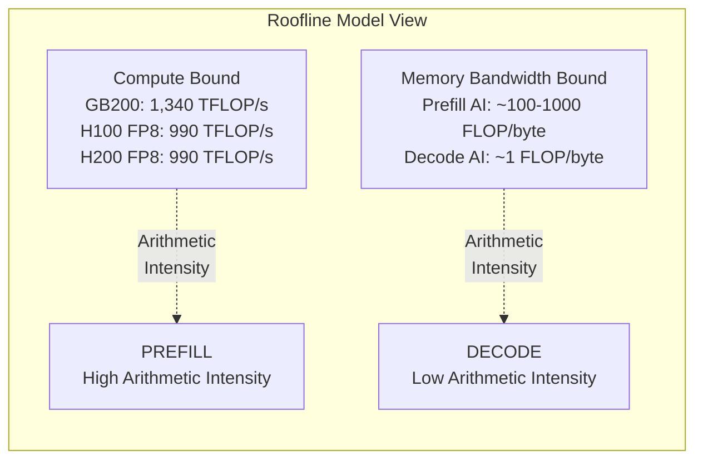

**Memory bandwidth specs across generations:**

| GPU | HBM Type | Memory BW | VRAM | FP16 TFLOP/s | FP8 TFLOP/s |
|-----|----------|-----------|------|---------------|-------------|
| A100 80GB SXM | HBM2e | 2,039 GB/s | 80 GB | 312 |   |
| H100 80GB SXM5 | HBM3 | 3,350 GB/s | 80 GB | 989 | 1,979 |
| H200 141GB SXM | HBM3e | 4,800 GB/s | 141 GB | 989 | 1,979 |
| B200 192GB SXM | HBM3e | 8,000 GB/s | 192 GB | 2,250 | 4,500 |
| GB200 (Grace-Blackwell) | HBM3e | 8,000 GB/s | 192 GB | 2,250 | 4,500 |

The H200's primary improvement over H100 is **43% more memory bandwidth** and **76% more VRAM** — both directly accelerating the decode phase. The GB200 doubles bandwidth again and adds native FP4 support.

---

## 3. Aggregated vs. Disaggregated Serving Configurations

This is the most consequential architectural decision in modern LLM serving. The field has shifted significantly: what was an academic proposal in 2023 (DistServe, Splitwise) is production reality in 2026.

### 3.1 Aggregated (Coupled) Architecture

In the **aggregated** configuration, every GPU in the pool handles both prefill and decode for the same requests.

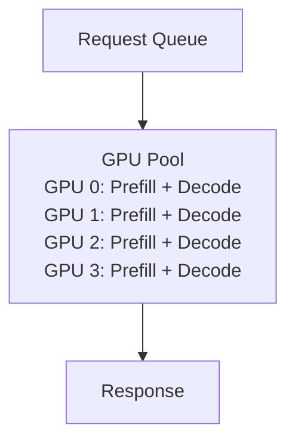

**Characteristics:**
- Simple to deploy and reason about
- KV cache stays on the same GPU (no transfer overhead)
- Prefill and decode compete for the same GPU memory and compute
- Long prefill operations ("prefill bubbles") stall ongoing decode batches
- GPU utilization is a function of the mix of prefill vs. decode load at any given moment
- Standard deployment: vLLM v0.x default, TGI, early SGLang

**Key failure mode:** Under high concurrency, a burst of long-context prefill requests stalls decode batches. P99 TTFT becomes extremely variable. GPU utilization oscillates between compute-bound (prefill) and bandwidth-bound (decode) states inefficiently.

### 3.2 Disaggregated (PD-Split) Architecture

In the **disaggregated** configuration, dedicated GPU pools handle prefill and decode separately. After prefill completes on a prefill instance, the KV cache is transferred to a decode instance over high-speed interconnect (NVLink, InfiniBand, or PCIe).

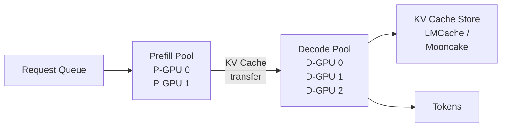

**Characteristics:**
- Prefill pool tuned for compute throughput (larger batch sizes, higher tensor parallelism)
- Decode pool tuned for memory bandwidth and latency (smaller TP, more instances)
- Each pool independently auto-scaled based on workload demand
- KV cache must be transferred between pools   this is the primary engineering challenge
- Enables independent optimization of TTFT (prefill pool scaling) and TPOT (decode pool scaling)
- Production users: SGLang (v0.5+), vLLM (V1 engine), AI-Dynamo, Mooncake (Kimi)

**Key engineering challenges:**
1. **KV transfer bandwidth**: For Llama 3 70B with 80 layers, GQA-8, 128 head dim, 4096-token context in BF16:  
   `KV = 2 × 80 × 8 × 128 × 4096 × 2 bytes = ~13.4 GB per request`  
   This makes network bandwidth a critical bottleneck.
2. **Transfer latency vs. prefill time**: Transfer must complete before decode can begin; for short prompts, transfer overhead dominates.
3. **KV cache routing and placement**: Which decode instance holds which request's KV cache affects load balancing and memory efficiency.

### 3.3 Configuration Trade-offs and Learnings

**SGLang's Disaggregated Serving Findings (v0.5+):**

SGLang introduced decode-side **radix cache reuse** for disaggregated serving   when multiple requests share KV prefix content, only one prefill is needed. In production at xAI, AMD, NVIDIA, LinkedIn, and Cursor:

- 85–95% cache hit rates for few-shot workloads vs. 15–25% in aggregated vLLM
- 75–90% cache hits for multi-turn chat vs. 10–20% for vLLM
- DeepSeek V3: **3.1× faster inference** than vLLM due to compounding prefix cache reuse

**Prefill/Decode Ratio Tuning:**

The optimal prefill-to-decode GPU ratio depends on workload:

| Workload Type | Typical Input/Output Ratio | Optimal P:D Ratio |
|---------------|---------------------------|-------------------|
| Chat (short context) | 200 in / 300 out | 1:4 |
| RAG / Document QA | 4000 in / 500 out | 1:1 |
| Code generation | 500 in / 1500 out | 1:3 |
| Long-document summarization | 16000 in / 300 out | 2:1 |
| Reasoning chains | 1000 in / 5000 out | 1:5 |

**Mooncake's Production Learnings (Kimi, 2024–2026):**

Mooncake, the serving platform for Kimi (Moonshot AI), implements disaggregated PD serving at massive scale:

- **KV-centric scheduling**: Instead of request-centric scheduling, Mooncake routes based on where KV cache data is located.
- **Global KV cache pool**: KV cache spans all nodes with CPU DRAM, GPU VRAM, and NVMe SSD as tiered storage.
- **Early rejection**: Overload scenarios are handled by early rejection with SLO-awareness rather than queuing indefinitely.
- **Result**: Near-zero stall rates for decode while maintaining high prefill throughput.

### 3.4 KV Cache Migration in Disaggregated Systems

KV cache transfer is the central technical challenge of PD disaggregation. Three transfer pathways exist:

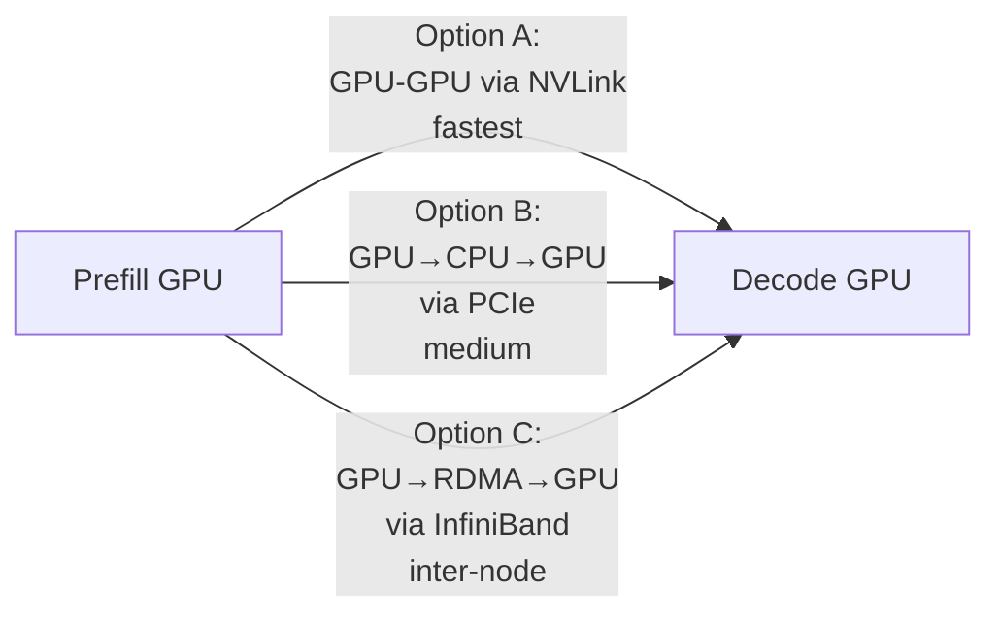

**Transfer time estimates for Llama 3 70B, 4096 tokens (BF16):**

| Transfer Method | Bandwidth | Transfer Time (13.4 GB) |
|----------------|-----------|------------------------|
| NVLink (GB200 NVL72) | 1,800 GB/s | ~7 ms |
| NVLink Switch (H100 NVL) | 900 GB/s | ~15 ms |
| InfiniBand NDR 400 Gbps | 50 GB/s | ~268 ms |
| PCIe 5.0 × 16 | 64 GB/s | ~210 ms |
| Ethernet 100 Gbps | 12.5 GB/s | ~1,072 ms |

**The implication**: NVLink-based disaggregation (same-chassis GB200 NVL72) is essentially free. Cross-node disaggregation over InfiniBand requires careful prompt-length thresholding   short prompts should not be disaggregated (transfer overhead > compute savings).

---

## 4. Hardware Landscape

### 4.1 NVIDIA H100 SXM5 — The Current Standard

The H100 remains the deployment standard for 2025-2026 production LLM serving:

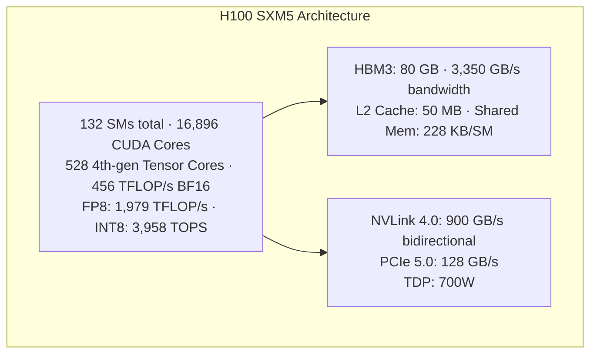

**Key serving characteristics:**
- **Hopper TMA (Tensor Memory Accelerator)**: Asynchronous memory copy bypasses L2 cache; enables FA3 (FlashAttention-3) with WGMMA + TMA pipeline
- **FP8 support**: Hardware-accelerated 8-bit floating point at 2× the throughput of BF16   critical for production throughput
- **NVLink 4.0**: 8-GPU HGX nodes with 900 GB/s all-to-all bandwidth, enabling TP=8 with minimal latency
- **Optimal workloads**: Dense models up to 70B at full precision, MoE models up to 671B with EP+TP parallelism

### 4.2 NVIDIA H200 — HBM3e and Memory Bandwidth Leap

The H200 is H100 compute with HBM3e memory — a targeted upgrade for memory-bandwidth-bound workloads:

**H100 vs H200 Comparison:**

| Specification    | H100 SXM5 | H200 SXM5 |
|------------------|------------|------------|
| HBM Type         | HBM3       | HBM3e      |
| VRAM Capacity    | 80 GB      | 141 GB     |
| Memory Bandwidth | 3,350 GB/s | 4,800 GB/s |
| BW Improvement   | baseline   | +43%       |
| VRAM Improvement | baseline   | +76%       |
| FP16 TFLOP/s     | 989        | 989        |
| FP8 TFLOP/s      | 1,979      | 1,979      |
| TDP              | 700 W      | 700 W      |

**Serving implications:**
- **Decode throughput**: Memory-bandwidth-bound decode sees near-linear throughput improvement: ~1.43× decode tokens/sec vs. H100 at same batch size
- **Longer context**: 141 GB enables Llama 3 70B at TP=2 to handle ~140K token KV cache vs. ~80K on H100
- **Larger models in memory**: A 70B BF16 model (140 GB) fits in a single H200 for 2-GPU inference; requires 4 H100s

**Optimal use cases:** Long-context workloads (RAG with large documents, multi-turn conversations, coding assistants with large codebases), high-batch decode serving where bandwidth is the bottleneck.

### 4.3 NVIDIA GB200 NVL72 — The Grace Blackwell Superchip

The GB200 represents a generational leap that fundamentally changes multi-GPU serving architectures:

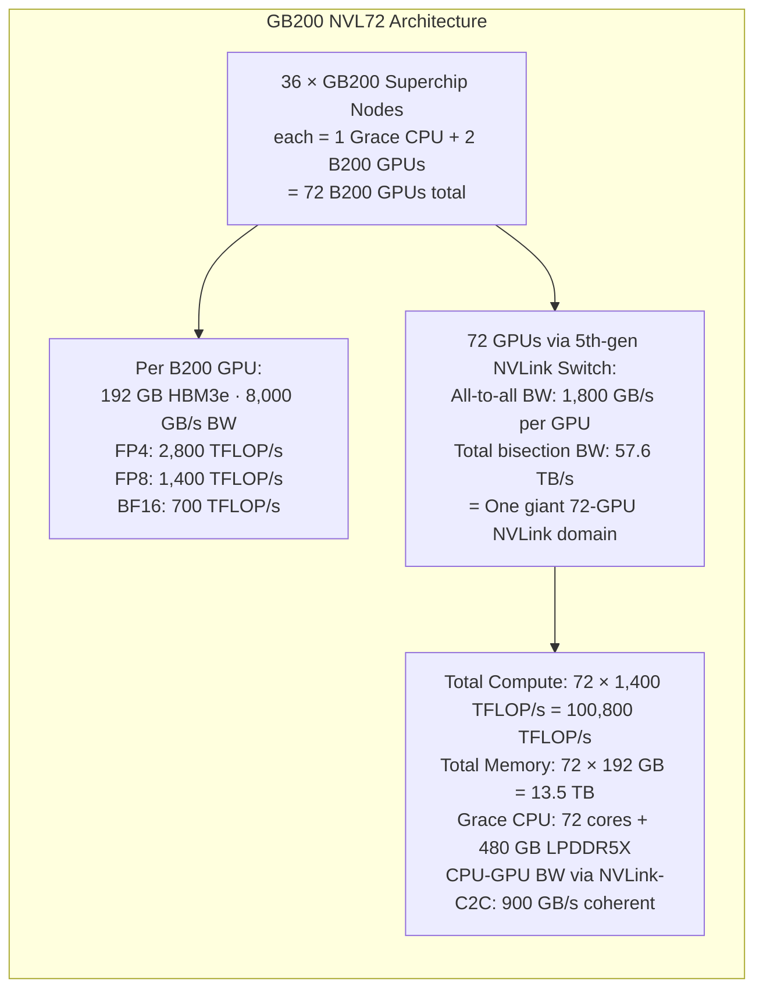

**Revolutionary serving implications:**

1. **FP4 Native**: B200 supports FP4 MXFP4 (Microscaling FP4) in hardware. DeepSeek-V3/R1 (671B, 37B activated MoE) runs at full batch in FP4, achieving near-FP8 quality at 2× the throughput.

2. **Disaggregation becomes trivial**: With 1,800 GB/s NVLink bandwidth across all 72 GPUs, PD disaggregation overhead for a 4096-token request is ~7ms. The entire 72-GPU rack can be treated as a single disaggregated serving unit.

3. **Expert parallelism at scale**: For DeepSeek-V3 with 256 experts (8 active per token), EP=256 across 72 GPUs is feasible with NVLink eliminating all-to-all bottlenecks.

4. **Grace CPU coherence**: The ARM Grace CPU with coherent NVLink-C2C connection to GPUs eliminates PCIe transfer overhead. KV cache migration between CPU DRAM and GPU HBM is 900 GB/s — comparable to older GPU-to-GPU NVLink.

**SGLang FP4 Results on GB200 (2026):**
- FP4/FP8 quantization support across NVIDIA GB200/B300/H100
- Expert and data parallelism tuned specifically for GB200 NVL72 topology

### 4.4 Interconnect: NVLink, NVSwitch, and Infiniband

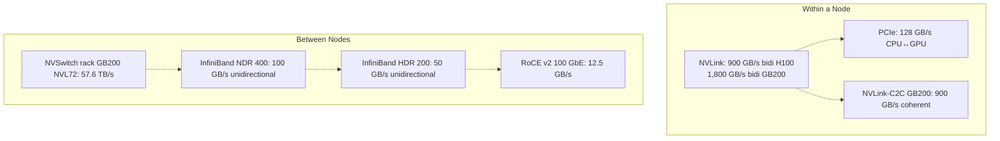

**Tensor parallelism communication cost analysis:**

For TP=N across LLama 3 70B (4096-dim hidden, BF16):
- AllReduce per layer = `2 × (N-1)/N × 4096 × seq_len × 2 bytes`
- At seq_len=1, batch=1: 32 KB per AllReduce
- At NVLink 900 GB/s: ~35 μs per AllReduce
- 80 layers = ~2.8 ms AllReduce overhead per decode step
- At TP=8 on H100 HGX: tolerable for batch serving, significant for single-stream latency

### 4.5 AMD MI300X — The Challenger

The MI300X deserves mention as a serious alternative for inference serving:

```
AMD MI300X Specifications:
┌──────────────────────┬───────────────────┐
│ HBM Capacity         │ 192 GB (HBM3)     │
│ Memory Bandwidth     │ 5,300 GB/s        │
│ FP16 TFLOP/s         │ 1,307             │
│ INT8 TOPS            │ 2,614             │
│ Infinity Fabric BW   │ 896 GB/s          │
│ TDP                  │ 750W              │
└──────────────────────┴───────────────────┘
```

The MI300X's 192 GB HBM at 5,300 GB/s makes it genuinely competitive for large-model serving where VRAM capacity and bandwidth are the bottleneck. ROCm AITER (AMD's inference kernel library) has been rapidly closing the gap with CUDA-optimized kernels for MoE routing and FlashAttention.

---

## 5. Model Architectures Under the Serving Lens

### 5.1 Dense Transformer Models

Dense transformer models (all parameters active for every token) include the Llama family, Phi, Mistral, Qwen, and Gemma. Their serving characteristics are well-understood:

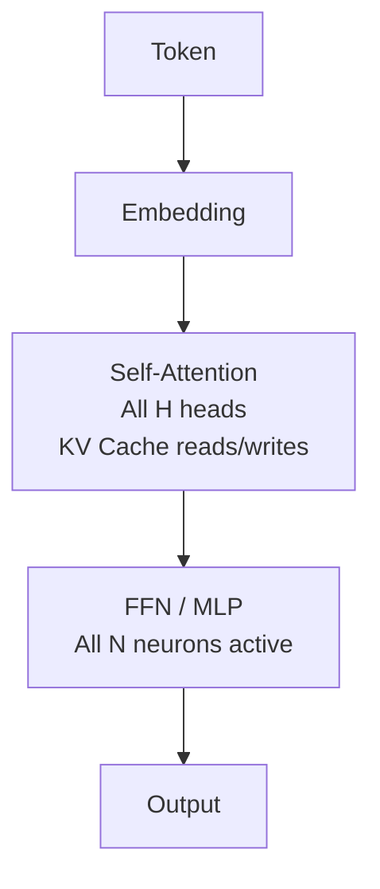

**Parameter count → VRAM → TP requirement table (BF16):**

| Model | Params | VRAM (BF16) | Min GPUs (H100 80GB) | Recommended TP |
|-------|--------|-------------|----------------------|----------------|
| Llama 3.1 8B | 8B | 16 GB | 1 | TP=1 |
| Llama 3.3 70B | 70B | 140 GB | 2 | TP=2–4 |
| Llama 3.1 405B | 405B | 810 GB | 12 | TP=8, PP=2 |
| Phi-4 15B | 14.7B | 29.4 GB | 1 | TP=1 |
| Qwen-3 32B | 32B | 64 GB | 1 (H200) | TP=1–2 |
| Gemma 2 27B | 27B | 54 GB | 1 | TP=1 |

**Attention variants in modern dense models:**

| Variant | KV Cache Size | Notes |
|---------|--------------|-------|
| MHA (Multi-Head Attention) | H × D × L | Oldest, largest KV |
| GQA (Grouped-Query Attention) | (H/G) × D × L | Llama 3, Qwen   G groups |
| MQA (Multi-Query Attention) | 1 × D × L | Minimal KV, lower quality |
| MLA (Multi-head Latent Attention) | compressed | DeepSeek V3   C×d_c latent |

**MLA (Multi-Head Latent Attention in DeepSeek V3)** is particularly notable: by compressing the KV representation into a low-rank latent space, the KV cache for DeepSeek V3 is only ~5.7% of what MHA would require   enabling dramatically longer context and higher batch sizes.

### 5.2 Mixture-of-Experts (MoE) Models

MoE models activate only a subset of their parameters (experts) for each token, providing a more favorable compute-to-parameter ratio:

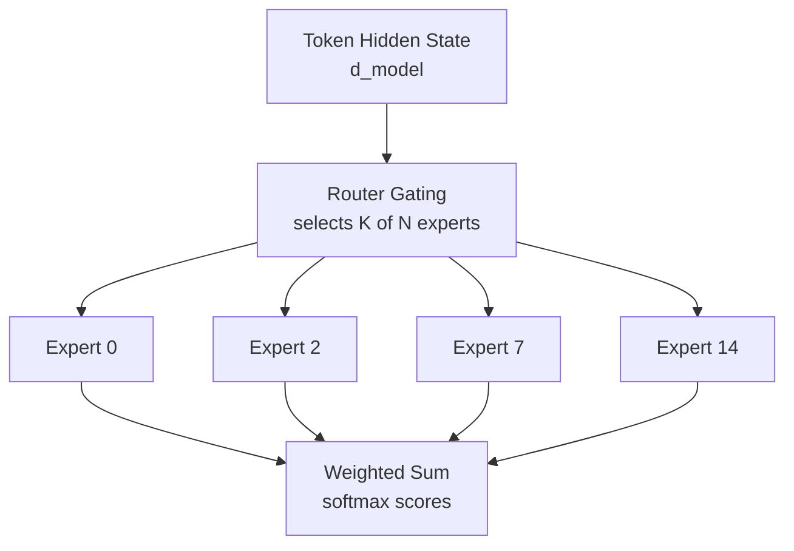

**Dominant MoE models (2026):**

| Model | Total Params | Active Params/Token | Expert Count | Experts/Token | Architecture |
|-------|-------------|--------------------:|-------------|--------------|--------------|
| DeepSeek-V3 | 671B | 37B | 256 | 8 | MoE + MLA |
| DeepSeek-R1 | 671B | 37B | 256 | 8 | MoE + MLA |
| Mixtral 8×7B | 47B | 13B | 8 | 2 | MoE |
| Mixtral 8×22B | 141B | 39B | 8 | 2 | MoE |
| Qwen-3 30B-A3B | 30B | 3B | 128 | 8 | MoE |
| Gemma 4 (MoE) | ~143B | ~27B | varies | varies | MoE |

**MoE serving advantages vs. dense:**
- **Compute efficiency**: Only `K/N` fraction of FFN parameters computed per token
- **Capacity efficiency**: More total parameters → richer world knowledge → better quality at same active compute
- **Memory efficiency**: With expert parallelism, MoE parameters are sharded across GPUs

**MoE serving challenges:**
- **Expert routing communication**: After routing, each token must reach its assigned expert's GPU   requiring AlltoAll collective operations
- **Load imbalance**: Some experts may be hot (frequently selected) while others are cold; dynamic load balancing is critical
- **Memory pressure**: All expert weights must be in GPU memory even if not active   for DeepSeek-V3 671B, this is ~1.3 TB just for FFN weights in BF16

### 5.3 MoE Serving: Expert Parallelism and Load Balancing

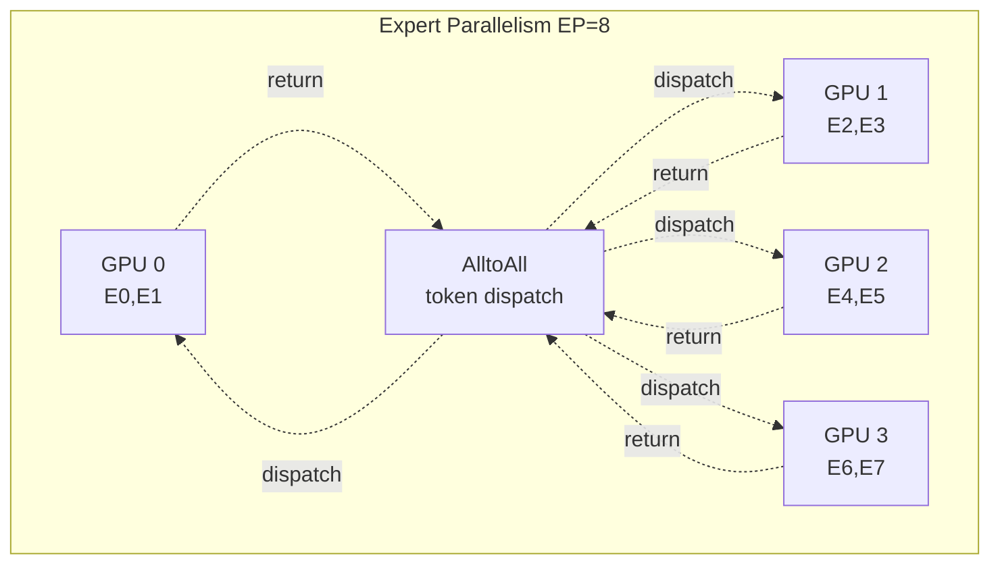

**AlltoAll communication cost for MoE:**
- Each token produces K routing decisions
- AlltoAll volume = `batch × seq × K × hidden_dim × dtype_size`
- On InfiniBand NDR: significant overhead, makes EP across nodes costly
- On NVLink (GB200 NVL72): AlltoAll across 72 GPUs at 1,800 GB/s   feasible for real-time serving

**SGLang's elastic expert parallel recovery (2026):** SGLang introduced fault-tolerant expert parallelism for large-scale MoE serving, allowing an expert group to recover from GPU failure without restarting the entire serving cluster   critical for 671B model deployments.

**Load balancing strategies:**

| Strategy | Description | Trade-off |
|----------|-------------|-----------|
| Auxiliary loss | Training-time regularization to equalize expert loads | Quality vs. balance |
| Expert capacity cap | Hard cap on tokens per expert per batch | May drop/re-route tokens |
| Dynamic expert selection | Router learns from utilization feedback | More complex training |
| DeepSeek's auxiliary-free load balancing | Sequence-level bias addition | Used in V3/R1 |

### 5.4 Multimodal and Multimodal-MoE Models

Multimodal models (LLaVA, Qwen-VL, Gemma 4 Vision) introduce additional serving challenges:

- **Variable-length visual tokens**: Image patches tokenized at different resolutions; longer images produce more tokens
- **Separate vision encoder**: Additional GPU memory and compute for vision transformer backbone
- **Chunked prefill for interleaved content**: TensorRT-LLM added chunked prefill for interleaved video/text layouts (reported by Inference Radar, May 2026)

For production multimodal serving, the prefill phase is particularly expensive   a 2048×2048 image at 14-pixel patch size produces ~21K visual tokens before the text prompt even begins.

---

## 6. KV Cache: The Central Resource

The KV cache is simultaneously the most valuable and most constrained resource in LLM serving. Every architectural decision   from GPU selection to parallelism strategy to serving topology   is ultimately about managing the KV cache.

### 6.1 PagedAttention and the Virtual Memory Analogy

**PagedAttention** (introduced in vLLM, 2023) applies OS virtual memory principles to KV cache management:

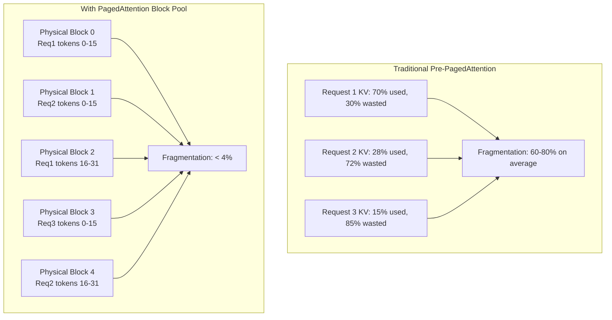

**PagedAttention implementation details:**
- Fixed-size "pages" (blocks), typically 16 or 32 tokens per block
- Virtual-to-physical block mapping via block tables (one per sequence)
- Blocks can be shared across sequences (prefix sharing)
- Copy-on-write for beam search and speculative decoding

**Limitations of PagedAttention (identified in vTensor research):**
1. **Tightly coupled**: Paged KV structure couples memory management with compute kernels. Custom kernels must explicitly handle paged addressing   preventing use of standard GEMM libraries for attention.
2. **Static pre-allocation**: vLLM pre-allocates ~83% of GPU memory for the KV cache pool at startup. This cannot be dynamically shared with other allocations.
3. **Compute penalty**: Paged attention CUDA kernels cannot use Tensor Cores in all configurations   particularly for GQA/MQA variants (vTensor research shows vLLM achieving only 3.6 TFLOP/s vs. 27.3 TFLOP/s for MQA due to CUDA-core-only execution).

### 6.2 Prefix Caching and RadixAttention

**Prefix caching** avoids recomputing the KV cache for shared prompt prefixes:

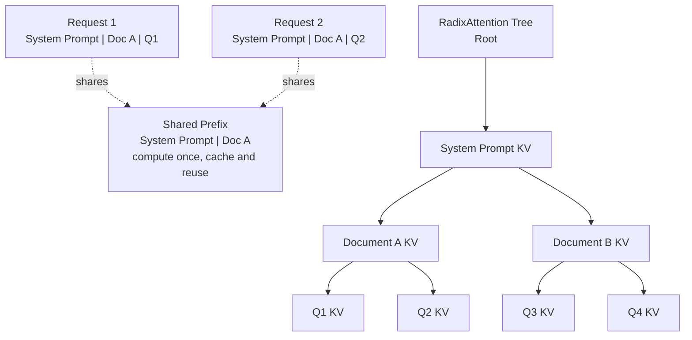

**RadixAttention** (SGLang) extends prefix caching with a radix tree data structure that automatically finds the longest common prefix across all cached sequences, maximizing reuse:

- **Cache hit rates:** 85–95% for few-shot workloads, 75–90% for multi-turn chat
- **Storage**: Cached KV blocks in the radix tree use LRU eviction when memory pressure builds
- **Cross-request sharing**: Multiple concurrent requests can share the same physical KV blocks for common prefixes (read-only sharing via copy-on-write)

### 6.3 vTensor: Virtual Memory-Based KV Management

The **vTensor** framework (from the 2024 FlexInfer paper) addresses PagedAttention's coupling limitations using CUDA Virtual Memory Management (VMM):

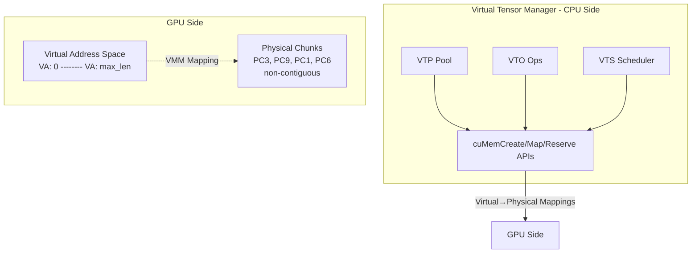

**vTensor advantages:**
- GPU kernel sees a standard contiguous tensor pointer   no changes needed to compute kernels
- Physical memory allocated only for tokens that exist (no pre-allocation bloat)
- Frees ~71.25% (57 GB) of memory vs. vLLM on A100 80 GB
- Enables Tensor Core utilization for GQA/MQA: **7.58× faster** for MQA vs. vLLM's paged attention
- Memory management on CPU overlaps with GPU compute (hidden overhead)

**Performance results:**
- 1.86× average speedup across models (single-generation, multi-turn, prefix sharing)
- 2.42× speedup for multi-turn chat
- Kernel: 3.92× vs. SGLang Triton prefix-prefilling, 3.27× vs. vLLM paged attention

### 6.4 GQA, MQA, and KV Cache Reduction

Attention Head Configurations:

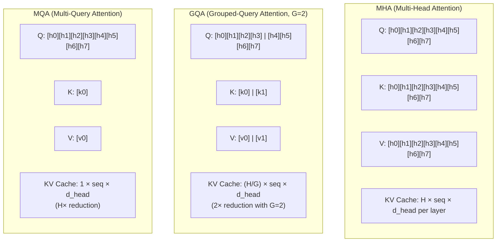

**KV cache size comparison for Llama 3.1 70B (GQA-8) at 8K tokens, BF16:**
- MHA equivalent: 80 layers × 64 heads × 128 dim × 8192 tokens × 2 bytes × 2 (K+V) = **167 GB**
- Actual GQA-8: 80 × 8 × 128 × 8192 × 2 × 2 = **20.9 GB**   8× reduction
- This is why GQA is now standard in all frontier dense models

---

## 7. KV Cache Transfer and Distribution

As disaggregated serving becomes standard and context lengths grow, the KV cache must flow across node boundaries. Two major projects address this: LMCache and Mooncake.

### 7.1 LMCache: The KV Cache Layer

**LMCache** is an open-source KV cache management system designed to supercharge LLM serving by acting as a transparent caching layer between inference backends:

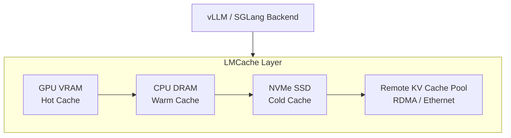

**LMCache capabilities:**

1. **Multi-tier storage**: KV cache spans GPU VRAM → CPU DRAM → NVMe → remote storage, using LRU eviction across tiers
2. **Disaggregation support**: KV blocks transferred from prefill to decode instances via RDMA
3. **Cross-instance sharing**: Multiple decode instances can read the same cached KV blocks for shared prefixes
4. **Backend compatibility**: Works as a plugin with both vLLM and SGLang without backend modifications
5. **Token-granular tracking**: Prefix matching at token granularity, similar to SGLang's RadixAttention

**Production metrics:** LMCache reports up to 10× throughput improvement for RAG workloads with high prefix sharing (common system prompts or document contexts).

### 7.2 Mooncake: Kimi's Serving Platform

**Mooncake** is the serving platform underpinning Kimi's production LLM service at Moonshot AI. Its architecture makes several fundamental departures from conventional serving wisdom:

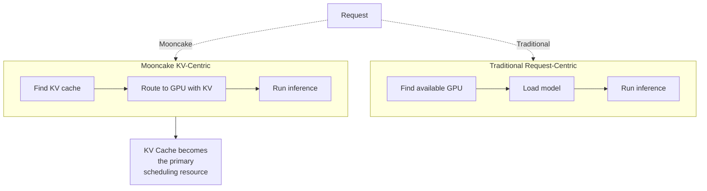

**Mooncake's Key Innovations:**

**1. KV Cache Pool as First-Class Resource:**
The global KV cache pool spans all nodes with hierarchical storage:
```
Tier 0: GPU HBM (fastest, smallest)     → active sequences
Tier 1: CPU DRAM (fast, medium)          → recently used KV
Tier 2: NVMe SSD (slower, large)         → historical context
Tier 3: Remote Object Storage            → cold archival
```

**2. Transfer Engine:**
A high-performance RDMA-based KV transfer system that can pipeline transfers with computation, hiding transfer latency behind ongoing decode:
- Uses RDMA for GPU→GPU KV transfer across nodes
- Leverages InfiniBand for inter-rack transfers
- Overlaps transfer with ongoing decode iterations

**3. Early Rejection with SLO Awareness:**
Rather than queuing requests indefinitely under overload, Mooncake implements SLO-aware early rejection:
- Maintains per-request deadline tracking
- Rejects requests when the predicted completion time exceeds SLO
- Preserves P99 latency for accepted requests even under extreme overload

**Production learnings:**
- Production deployment for Kimi at hundreds of thousands of daily active users
- KV-centric routing reduces cold prefill computation by exploiting cross-user prefix sharing
- The transfer engine achieves near-line-rate KV migration, making disaggregation practical at scale

---

## 8. Attention Kernel Engineering

The attention operation is the innermost computational loop of every transformer. Its efficiency determines serving throughput, and its implementation complexity has driven an entire sub-ecosystem of kernel engineering.

### 8.1 FlashAttention Evolution: FA1 → FA2 → FA3

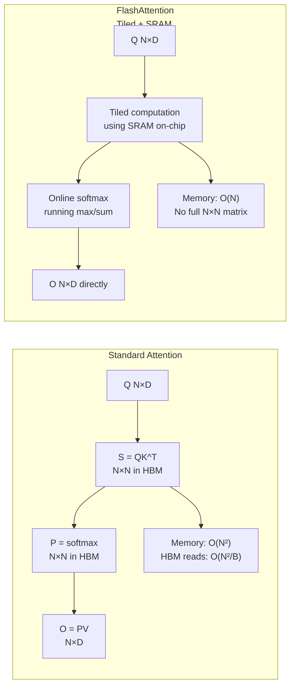

| Version | Key Innovation | GPU Target | Key Benefit |
|---------|---------------|-----------|-------------|
| FA1 | Online softmax, tiled SRAM | A100 (sm80) | 2-4× faster than PyTorch |
| FA2 | Better loop ordering, GQA support | A100, H100 | 2× faster than FA1 |
| FA3 | WGMMA + TMA pipeline (Hopper) | H100 (sm90a) | 1.5-2× faster than FA2 |
| Flash-Decoding | Parallel KV split for decoding | H100 | Low-batch decode speedup |

**FA3 Hopper-specific optimizations:**
- **WGMMA (Warpgroup Matrix Multiply-Accumulate)**: Uses the full 4-warpgroup tensor core interface, doubling matrix multiply throughput vs. WMMA
- **TMA (Tensor Memory Accelerator)**: Asynchronous memcopy bypassing L2 for large KV loads
- **Ping-pong warpgroup pipeline**: Overlaps WGMMA computation with TMA data loading
- **Result**: FlashAttention3 achieves 75% of theoretical H100 FP16 FLOP/s

### 8.2 FlashInfer: Customizable Attention Engine

**FlashInfer** is a production-grade, code-generation-based attention engine designed to address the heterogeneity of LLM serving workloads. It has been integrated into SGLang, vLLM, and MLC-Engine.

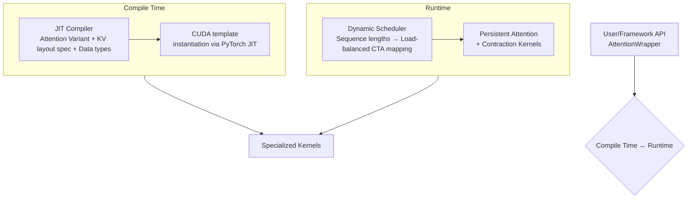

**FlashInfer's three core innovations:**

**1. Block-Sparse Format for KV Heterogeneity:**
PagedAttention's page tables, RadixAttention's radix tree, and tree-structured speculative decoding KV caches are all unified under Block-Sparse Row (BSR) format:
- Adjustable block sizes `(B_r, B_c)`   from `(1,1)` (token-level) to `(128,128)` (page-level)
- Composable formats: prefix KV in large-block sparse matrix + unique KV in small-block sparse matrix, combined in a single attention pass

**2. JIT Compiler for Attention Variants:**
A CUDA template system that generates optimized kernels for any attention variant:
```
Supported variants (via JIT):
  ● QueryTransform:  RoPE, normalization, MLA projection
  ● KeyTransform:    RoPE, MLA decompression
  ● LogitsTransform: logit soft-cap (Gemma), logit scaling
  ● LogitsMask:      sliding window attention (Gemma), causal mask
  ● OutputTransform: FlashSigmoid, custom output processing
```

**3. Load-Balanced Dynamic Scheduling:**
Solves the load-imbalance problem in batched decode when requests have widely varying KV lengths:

```
Problem:
  Request A: KV length = 100   ← CTA finishes quickly
  Request B: KV length = 10,000 ← CTA runs 100× longer
  Result: Most CTAs idle while B's CTA is still running

FlashInfer Solution (Stream-K inspired):
  1. Estimate cost per tile: cost(l_q, l_kv) = α·l_q + β·l_kv
  2. Compute max chunk size L_kv to equalize CTA load
  3. Split long KV sequences into chunks across multiple CTAs
  4. Aggregate partial attention states using the composition operator
  5. Plan computed on CPU, copied to GPU asynchronously
  6. Compatible with CUDAGraph (fixed grid size)
```

**FlashInfer Performance Results (H100 80GB SXM):**
- **29–69% inter-token-latency reduction** vs. Triton backend for LLM serving
- **28–30% latency reduction** for long-context inference
- **13–17% speedup** for parallel generation (speculative decoding)

### 8.3 Block-Sparse Formats and Composable Attention

**Composable formats** in FlashInfer enable efficient handling of prefix-sharing workloads without data movement:

```mermaid
graph TB
    Requests["12 requests<br/>First 6 share prefix<br/>Last 6 share different prefix"]
    
    SharedKV["Shared Prefix KV<br/>block size 3,1"]
    UniqueKV["Unique Suffix KV<br/>block size 1,1"]
    
    Requests --> SharedKV
    Requests --> UniqueKV
    
    Attn1["attention Q, KV_shared<br/>block=3,1"]
    Attn2["attention Q, KV_unique<br/>block=1,1"]
    
    SharedKV --> Attn1
    UniqueKV --> Attn2
    
    Compose["Output = Attn1 ⊕ Attn2<br/>Attention state composition operator"]
    
    Attn1 --> Compose
    Attn2 --> Compose
```

This composability (borrowed from Ring-Attention and Flash-Decoding) allows FlashInfer to process prefix and suffix KV simultaneously without materializing a combined, non-contiguous attention matrix.

### 8.4 Load-Balanced Dynamic Scheduling

The scheduling compatibility with CUDAGraph is critical for production serving:

```mermaid
graph TB
    subgraph Init["Init Phase"]
        Wrapper["attn = AttentionWrapper<br/>spec, task, ws"]
        Graph["g = CUDAGraph"]
        Plan["attn.plan seqlen_dummy<br/>NOT captured"]
        Run["attn.run q, k, v<br/>captured"]
        Compiled["JIT compiled<br/>graph captured"]
        
        Wrapper --> Graph
        Graph --> Plan
        Graph --> Run
        Run --> Compiled
    end
    
    subgraph Runtime["Runtime Phase per decode step"]
        Update["seqlen.update<br/>update lengths"]
        Planning["attn.plan seqlen<br/>CPU planning"]
        Copy["Plan copied to GPU<br/>asynchronously"]
        Replay["g.replay<br/>GPU execution"]
        
        Update --> Planning
        Planning --> Copy
        Copy --> Replay
    end
    
    Note["Key insight: plan runs on CPU<br/>run runs in captured CUDA graph<br/>Fixed grid size satisfies CUDAGraph"]
```

---

## 9. Serving Engine Deep Dives

### 9.1 vLLM   The Reference Implementation

**GitHub:** [vllm-project/vllm](https://github.com/vllm-project/vllm) | **Stars:** 79,765+ | **License:** Apache 2.0

vLLM remains the broadest, most actively developed open-source LLM serving engine. It introduced PagedAttention and has since evolved into a comprehensive serving platform.

```mermaid
graph TB
    subgraph vLLMStack["vLLM V1 Architecture"]
        API["API Server FastAPI<br/>OpenAI-compatible<br/>+ Anthropic API"]
        
        Engine["Engine Core V1<br/>Async Scheduler<br/>overlapped execution<br/><br/>KV Cache Manager<br/>PagedAttention"]
        
        Workers["GPU Workers<br/>W0, W1, W2, W3<br/>TP=4 example<br/><br/>FlashInfer / Triton<br/>custom CUDA kernels"]
        
        API --> Engine
        Engine --> Workers
    end
```

**vLLM V1 key improvements:**
- **Overlapped scheduling**: CPU-side scheduling pipelined with GPU execution, hiding scheduling overhead
- **KV transfer (disaggregated)**: LMCache integration for PD disaggregation
- **Speculative decoding**: EAGLE, n-gram, DFlash methods
- **Multi-backend**: NVIDIA, AMD ROCm, Intel XPU, CPU (via OpenVINO/ATEN)

**Supported model scope (2026):**
- 200+ architectures natively from HuggingFace
- MoE: DeepSeek-V3/R1, Mixtral, Qwen-MoE, Gemma 4 MoE
- Multimodal: LLaVA, Qwen-VL, Gemma 4 Vision
- Embedding models for RAG pipelines

**Performance (H100 SXM5, Llama 3.3 70B FP8, 100 concurrent requests):**
- Throughput: ~2,400 tok/s
- TTFT P50/P95: 740ms / 1,450ms
- Cold start: ~62 seconds

**vLLM Disaggregated Serving Configuration:**
```yaml
# vLLM disaggregated serving (example config)
prefill_instances:
  - num_gpus: 4
    tensor_parallel: 4
    chunked_prefill: true
    max_num_batched_tokens: 32768

decode_instances:
  - num_gpus: 8
    tensor_parallel: 2
    num_instances: 4
    
kv_transfer:
  backend: lmcache  # or rdma, nccl
  bandwidth: 400Gbps
```

### 9.2 SGLang — The Throughput Leader

**GitHub:** [sgl-project/sglang](https://github.com/sgl-project/sglang) | **Stars:** 27,694+ | **License:** Apache 2.0

SGLang has emerged as the throughput leader for workloads involving shared prefixes and structured generation, powered by production deployments at xAI, AMD, NVIDIA, LinkedIn, and Cursor.

SGLang Architecture:

```mermaid
flowchart TB

    API["OpenAI-Compatible API"]

    subgraph RT["SGLang Runtime"]
        direction TB

        subgraph FEATURES[" "]
            direction LR

            RA["RadixAttention<br/>Prefix Cache"]
            XG["xGrammar (Structured)<br/>JSON/regex decoding"]
        end

        subgraph DS["Disaggregated Serving"]
            direction TB

            NOTE["Decode-side radix cache reuse"]

            PF["Prefill Pool"]
            KV["KV Transfer"]
            DP["Decode Pool"]

            PF --> KV --> DP
        end
    end

    GPU["GPU Workers (FlashInfer backend)<br/>FP4/FP8/INT4/AWQ/GPTQ across H100/GB200/MI300"]

    API --> RT
    RT --> GPU
```

**SGLang's differentiating features:**

1. **RadixAttention**: Radix-tree prefix cache with 85–95% hit rates for shared-prefix workloads
2. **xGrammar**: Grammar-guided structured output (JSON, regex) with 10× faster generation than naive constrained decoding; compiled grammars cached in radix tree
3. **Disaggregated serving**: Decode-side radix cache reuse   even after KV transfer to a decode instance, the radix tree tracks which prefix KV blocks can be reused across requests
4. **Elastic expert parallel recovery**: MoE expert groups recover from GPU failure without full cluster restart
5. **Diffusion model serving**: Dynamic batching for diffusion models alongside LLM serving (text + image/video under one scheduler)

**Performance (H100 SXM5, Llama 3.3 70B FP8, 100 concurrent):**
- Throughput: ~2,460 tok/s (~2.5% faster than vLLM for standard benchmarks)
- **DeepSeek V3: 3.1× faster than vLLM** due to prefix cache compounding
- Cold start: ~58 seconds

**Scale:** Powers 400,000+ GPUs globally, trillions of tokens daily.

### 9.3 NVIDIA TensorRT-LLM   Maximum Performance

**GitHub:** [NVIDIA/TensorRT-LLM](https://github.com/NVIDIA/TensorRT-LLM) | **Stars:** 13,614+ | **License:** Apache 2.0

TensorRT-LLM achieves the highest raw throughput at the cost of a 28-minute per-model compilation step. It is the engine of choice for high-volume, single-model deployments.

```mermaid
graph TB
    Weights["HuggingFace Weights"]
    
    Build["TensorRT Engine Build<br/>~28 min per model/config<br/>Graph optimization<br/>Kernel fusion<br/>Quantization FP8/FP4/INT4<br/>CUDA Graph capture"]
    
    Runtime["TensorRT Runtime<br/>In-flight batching<br/>Paged KV cache<br/>FlashAttention<br/>MoE plugin FP16/FP8"]
    
    Triton["Triton Inference Server<br/>HTTP/gRPC endpoints<br/>Typical production deployment"]
    
    Weights --> Build
    Build --> Runtime
    Runtime --> Triton
```

**Performance (H100 SXM5, Llama 3.3 70B FP8, 100 concurrent):**
- Throughput: ~2,780 tok/s (~16% faster than vLLM)
- TTFT P50/P95: 680ms / 1,280ms (best in class)
- Cold start: ~28 min (initial compile) + ~90 sec (subsequent warm starts)

**GB200/Blackwell support (2026):**
- Native FP4 (MXFP4) support   2× throughput vs. FP8 on B200
- DFlash speculative decoding
- Chunked prefill for interleaved video/text multimodal content
- Sparse MLA (Multi-head Latent Attention) for DeepSeek models

**Blink + TensorRT-LLM (CPU-Free Inference):**
Recent research (Blink, 2026) wraps TensorRT-LLM engines in a CPU-free serving architecture:
- TensorRT engines pre-compiled and deployed as CUDA graphs
- GPU-resident scheduler selects and launches graphs without CPU involvement
- BlueField-3 DPU handles network I/O via RDMA
- Result: P99 TTFT reduced by up to 8.47× vs. TRT-LLM with CPU orchestration

### 9.4 llama.cpp   Portability Champion

**GitHub:** [ggml-org/llama.cpp](https://github.com/ggml-org/llama.cpp) | **License:** MIT

llama.cpp is the portability champion of the inference ecosystem   a C++ implementation that runs on CPUs, consumer GPUs, Apple Silicon, and specialized hardware without dependencies on CUDA or PyTorch.

```mermaid
graph TB
    subgraph Backends["llama.cpp Backend Support Matrix"]
        CUDA["CUDA<br/>NVIDIA GPUs any CUDA-capable"]
        Metal["Metal<br/>Apple Silicon M1-M4 series"]
        Vulkan["Vulkan<br/>AMD, Intel, Mobile GPUs"]
        OpenCL["OpenCL<br/>Legacy GPU support"]
        SYCL["SYCL<br/>Intel GPUs"]
        AVX2["CPU AVX2<br/>Any x86-64 with AVX2"]
        NEON["CPU NEON<br/>ARM processors"]
        BLAS["OpenBLAS<br/>Generic BLAS-capable systems"]
    end
```

**GGUF Quantization Formats:**

| Format | Bits | Quality vs. FP16 | Size 7B model |
|--------|------|-----------------|----------------|
| Q8_0 | 8 | ~99.5% | ~7.7 GB |
| Q5_K_M | 5 | ~98% | ~5.0 GB |
| Q4_K_M | 4 | ~96% | ~4.1 GB |
| Q3_K_M | 3 | ~92% | ~3.3 GB |
| Q2_K | 2 | ~83% | ~2.7 GB |
| IQ1_S | ~1.5 | ~72% | ~1.6 GB |

**llama-server (built-in OpenAI-compatible server):**
- Exposes `/v1/chat/completions`, `/v1/completions`, `/v1/embeddings`
- Prometheus metrics endpoint
- Anthropic Messages API (added late 2025)
- Continuous batching with configurable batch size
- Speculative decoding (draft model support)

**Production ceiling:** At 50 concurrent users, throughput plateaus at ~155 tok/s. For developer workstations, local inference, and CPU-only environments, it's unrivaled. For production scale, migrate to vLLM or SGLang.

### 9.5 Triton Inference Server   Enterprise Orchestration

**GitHub:** [triton-inference-server/server](https://github.com/triton-inference-server/server)

NVIDIA Triton Inference Server is the production deployment layer that sits above TensorRT-LLM (and other backends) for enterprise deployments:

```mermaid
graph TB
    Clients["HTTP/gRPC Clients"]
    
    Triton["Triton Inference Server<br/>Dynamic batching<br/>Model ensemble support<br/>Multi-model serving<br/>Request validation / rate limiting<br/>Prometheus / OpenTelemetry metrics"]
    
    TRT["TRT-LLM<br/>Backend"]
    PyTF["PyTorch/TF<br/>Backend"]
    Python["Python<br/>Backend"]
    
    Clients --> Triton
    Triton --> TRT
    Triton --> PyTF
    Triton --> Python
```

**Production features:**
- gRPC streaming for token-by-token SSE streaming
- Model warm-up and health checking
- Concurrent model instance management
- Binary wheel distribution for deployment

### 9.6 Ray Serve   Distributed Serving Control Plane

**GitHub:** [ray-project/ray](https://github.com/ray-project/ray)

Ray Serve operates as a serving orchestration layer above individual inference backends (vLLM, SGLang, TRT-LLM), providing:

```mermaid
graph TB
    Client["Client Traffic"]
    
    Ingress["Ray Serve Ingress<br/>load balancing, auth"]
    
    vLLM0["vLLM Replica 0<br/>4×H100"]
    vLLM1["vLLM Replica 1<br/>4×H100"]
    SGLang["SGLang Replica 0<br/>8×H100"]
    
    Client --> Ingress
    Ingress --> vLLM0
    Ingress --> vLLM1
    Ingress --> SGLang
```

**Key 2026 additions:**
- **Kubernetes in-place pod resizing**: Dynamically resize GPU pod allocations without restart   critical for cost-optimized inference clusters
- **Configurable rolling update percentages**: Gradual rollout of model updates with configurable blast radius
- **vLLM integration fixes**: Deep integration for multi-replica vLLM deployments
- **Ingress routing**: Custom routing logic for A/B testing, canary deployments

### 9.7 KubeAI   Kubernetes-Native Serving

**GitHub:** [kubeai-project/kubeai](https://github.com/kubeai-project/kubeai)

KubeAI provides Kubernetes-native LLM serving with automatic scaling, model management, and multi-backend support. It complements Ray Serve by providing a more Kubernetes-idiomatic deployment experience:

```mermaid
graph TB
    kubectl["kubectl / Helm"]
    
    Operator["KubeAI Operator<br/>CRDs: AIModel<br/>InferenceService"]
    
    vLLM["vLLM<br/>Deployment"]
    Ollama["Ollama<br/>Deployment"]
    SGLang["SGLang<br/>Deployment"]
    
    Auto["Auto-scaling HPA/KEDA<br/>based on queue depth"]
    
    kubectl --> Operator
    Operator --> vLLM
    Operator --> Ollama
    Operator --> SGLang
    
    vLLM --> Auto
    Ollama --> Auto
    SGLang --> Auto
```

**Advantages over raw Kubernetes:** 
- Custom model CRDs with automatic GPU scheduling
- KEDA-based autoscaling based on inference queue depth
- Multi-backend abstraction (same CRD for vLLM, SGLang, Ollama)
- HuggingFace model cache management

---

## 10. Scheduling, Batching, and Control Plane Design

### 10.1 Continuous Batching (Orca)

**Iteration-level scheduling** (Orca, 2022) replaced static batch scheduling and remains the foundation of all modern serving systems:

```mermaid
graph TB
    subgraph Static["Static Batching Pre-Orca"]
        I1["Iteration 1: ReqA, ReqB, ReqC<br/>wait for ALL to finish"]
        I2["Iteration 2: ReqD, ReqE, ReqF"]
        Idle1["GPU idle: ~40%"]
        
        I1 --> I2 --> Idle1
    end
    
    subgraph Continuous["Continuous Batching Orca"]
        S1["Step 1: ReqA, ReqB, ReqC"]
        S2["Step 2: ReqA, ReqB, ReqC"]
        S3["Step 3: ReqA, ReqC, ReqD joins"]
        S4["Step 4: ReqA, ReqC, ReqD, ReqE joins"]
        Idle2["GPU idle: ~5%"]
        
        S1 --> S2 --> S3 --> S4 --> Idle2
    end
    


```

**Implementation mechanics:**
- After each decode step, the scheduler checks for completed requests (EOS token generated)
- New requests from the queue are admitted to fill freed batch slots
- PagedAttention/vTensor enables this by handling variable-length sequences without memory fragmentation

### 10.2 Chunked Prefill and Stall Reduction

**Chunked prefill** (Sarathi-Serve, 2023; now standard in vLLM, SGLang, TRT-LLM) splits long prefill operations into smaller chunks and interleaves them with decode steps:

```mermaid
graph TB
    subgraph WithoutChunk["Without Chunked Prefill"]
        P1["Step 1: PREFILL Req A, 8192 tokens<br/>decode requests stall ~200ms"]
        D1["Step 2-3: DECODE ReqA, ReqB, ReqC"]
        
        P1 --> D1
    end
    
    subgraph WithChunk["With Chunked Prefill chunk_size=512"]
        P1C["Step 1: PREFILL Req A tokens 0-511<br/>+ DECODE ReqB, ReqC"]
        P2C["Step 2: PREFILL Req A tokens 512-1023<br/>+ DECODE ReqA, ReqB, ReqC"]
        PN["..."]
        PNC["Step 16: PREFILL Req A tokens 7680-8191<br/>+ DECODE all"]
        
        P1C --> P2C --> PN --> PNC
    end
    


```

**Trade-off:** Chunked prefill increases TTFT for the prefill request (split across 16 steps instead of 1) but dramatically reduces P99 TTFT for concurrent decode requests. The chunk size is a tunable parameter:
- Larger chunks: Lower TTFT for prefill, higher latency stalls for decode
- Smaller chunks: Higher TTFT for prefill, minimal decode stalls

### 10.3 Speculative Decoding

**Speculative decoding** uses a small draft model to propose multiple tokens at once, which the large target model then verifies in parallel:

```mermaid
graph LR
    Draft["Draft Model Fast, Small<br/>Context → token₁, token₂,<br/>token₃, token₄<br/>propose K tokens"]
    
    Target["Target Model Slow, Large<br/>Context + token₁ + token₂<br/>+ token₃ + token₄<br/>Parallel verification pass"]
    
    Result["Result:<br/>Accept, Accept, Reject, N/A<br/><br/>Accepted: token₁, token₂<br/>+ target's correction token<br/><br/>Speedup: ~2-3×<br/>typical 60-80% acceptance"]
    
    Draft --> Target
    Target --> Result
```

**Speculative decoding variants in 2026:**

| Method | Draft Proposal | Typical Speedup |
|--------|---------------|-----------------|
| Draft model | Separate smaller model | 2-3× |
| n-gram | Suffix tree matching in context | 1.2-1.5× |
| EAGLE | Trained feature-based draft | 2.5-3.5× |
| DFlash | Flash-decoding-based draft | 1.5-2× |
| MTP (Multi-Token Prediction) | Target model self-speculation | 1.5-2× |

**Gemma 4 MTP speculative decoding** (shipped in Ollama and mlx-vlm, May 2026) uses Gemma 4's built-in multi-token prediction head for self-speculation without a separate draft model.

### 10.4 CPU-Free Inference: Blink Architecture

**Blink** (KTH Royal Institute of Technology, 2026) represents a fundamentally different approach: eliminating the host CPU from the steady-state inference path entirely.

```mermaid
graph TB
    subgraph Trad["Traditional Serving CPU on Critical Path"]
        TGen["Token Generated"]
        TCPU["CPU Scheduler<br/>scheduling overhead: 50%"]
        TKV["KV Cache Update"]
        TKernel["CUDA Kernel Launch"]
        TGPU["GPU Compute"]
        TGen2["Token Generated next"]
        
        TGen --> TCPU
        TCPU --> TKV
        TKV --> TKernel
        TKernel --> TGPU
        TGPU --> TGen2
    end
    
    subgraph BlinkArch["Blink CPU-Free"]
        BGen["Token Generated"]
        BPersist["GPU-Resident Scheduler<br/>256-thread block<br/>infinite loop"]
        BLaunch["Device-side CUDA Graph<br/>fire-and-forget<br/>~2μs latency vs 11-17μs host"]
        BGPU["GPU Compute"]
        BGen2["Token Generated"]
        
        BGen --> BPersist
        BPersist --> BLaunch
        BLaunch --> BGPU
        BGPU --> BGen2
    end
    


```

**Blink's technical components:**

1. **GPU-resident persistent scheduler**: A single 256-thread persistent CUDA kernel manages:
   - Continuous batching (FCFS policy, matches vLLM/TRT-LLM for fair comparison)
   - KV cache block management
   - Request admission and completion detection
   - No per-token CPU interaction required

2. **Device-side CUDA graph launch** (fire-and-forget mode): Enables the GPU scheduler to launch inference graphs without a CPU round-trip. Key constraint: 120-launch limit per graph execution window.
   - **Solution**: Window-based tail-launch recovery   fire-and-forget for 120 steps, single tail-launch at step 121 to reset
   - Overhead: < 0.03% per decode step
   - Speedup: 58× faster than host-side launch per kernel dispatch

3. **BlueField-3 DPU frontend**: 
   - Handles HTTP parsing, tokenization (8–19.7× faster than HuggingFace tokenizer on ARM NEON)
   - One-sided RDMA writes tokenized prompts directly into GPU VRAM ring buffer
   - No host CPU involvement in data path

4. **GPU-resident ring buffer**: Shared between DPU and GPU via RDMA
   - 4,096 slots, each tracking request state machine
   - Atomic CAS for concurrent slot management
   - DPU writes prompts; GPU scheduler reads and produces tokens

**Measured results (H100, Llama-3 8B, ShareGPT, Xeon Gold baseline):**

| Metric | vLLM | TRT-LLM | SGLang | Blink |
|--------|------|---------|--------|-------|
| P99 TTFT (isolated) | 150ms | ~120ms | ~110ms | **17.7ms** |
| P99 TTFT reduction vs. TRT |   | baseline | ~8% | **8.47×** |
| P99 TPOT | 14.4ms | ~12ms | ~11ms | **4.2ms** |
| Decode Throughput | 7,475 tok/s | ~8,000 | ~8,500 | **~15,700 tok/s** |
| Under CPU interference | -83% throughput | -72% | -68% | **0% degradation** |

**The colocation case:** In production, GPU servers colocate LLM inference with CPU-intensive workloads (batch jobs, background processing). Under CPU interference:
- vLLM throughput drops from 7,475 to 1,961 tok/s (−74%)
- P99 TTFT inflates from 150ms to 20,959ms (139×)
- Blink: completely unaffected (CPU not on critical path)

**Energy efficiency:** Blink reduces energy per token by 48.6% vs. isolated baselines, and up to 70.7% under CPU interference   because CPU-induced GPU idle time is eliminated.

---

## 11. Parallelism Strategies

Large models require distributing computation across multiple GPUs. The choice of parallelism strategy profoundly impacts inference latency, throughput, and hardware efficiency.

### 11.1 Tensor Parallelism (TP)

**Tensor Parallelism** shards individual weight matrices across GPUs. Each GPU holds a slice of every weight and computes a partial result, synchronized via AllReduce:

```mermaid
graph TB
    subgraph TP4["TP=4 for Linear Layer d_model=4096"]
        GPU0["GPU 0: W0:1024"]
        GPU1["GPU 1: W1024:2048"]
        GPU2["GPU 2: W2048:3072"]
        GPU3["GPU 3: W3072:4096"]
        
        AllRed["AllReduce<br/>Compute partial output<br/>Synchronize"]
        
        GPU0 --> AllRed
        GPU1 --> AllRed
        GPU2 --> AllRed
        GPU3 --> AllRed
        
        Output["Full output on all GPUs"]
        AllRed --> Output
    end
```

**TP trade-offs:**
- **Benefits**: Reduces per-GPU memory → enables larger batch sizes; reduces forward-pass latency via parallelism
- **Costs**: AllReduce communication overhead; requires fast intra-node interconnect (NVLink)
- **Optimal range**: TP=2-4 on H100 NVL; TP=8 only for models that don't fit otherwise

### 11.2 Pipeline Parallelism (PP)

**Pipeline Parallelism** splits model layers across GPUs sequentially:

```mermaid
graph TB
    subgraph PP4["PP=4 for 80-layer model"]
        G0["GPU 0<br/>Layers 0-19"]
        G1["GPU 1<br/>Layers 20-39"]
        G2["GPU 2<br/>Layers 40-59"]
        G3["GPU 3<br/>Layers 60-79"]
        
        G0 --> G1
        G1 --> G2
        G2 --> G3
    end
    
    Pipeline["Micro-batch pipeline:<br/>t=0: GPU0 processes mb-0<br/>t=1: GPU1 processes mb-0, GPU0 processes mb-1<br/>t=2: GPU2 processes mb-0, GPU1 processes mb-1, GPU0 processes mb-2<br/>...<br/>Pipeline bubble = GPU idle at start/end<br/>Efficiency = total_steps - num_stages + 1 / total_steps"]
```

**PP trade-offs:**
- **Benefits**: No AllReduce (only point-to-point activation transfer); enables very large models
- **Costs**: Pipeline bubble overhead; higher latency (activation must traverse full pipeline)
- **Use case**: Models too large for single-node TP; Llama 405B needs PP to span multiple nodes

### 11.3 Expert Parallelism (EP) for MoE

**Expert Parallelism** assigns different experts to different GPUs, using AlltoAll to route tokens:

```mermaid
graph TB
    subgraph EPArch["EP=8 for Mixtral 8x7B"]
        GPU0["GPU 0<br/>Expert 0"]
        GPU1["GPU 1<br/>Expert 1"]
        GPU2["GPU 2<br/>Expert 2"]
        GPU7["GPU 7<br/>Expert 7"]
        
        AlltoAll1["AlltoAll Send<br/>tokens to experts"]
        AlltoAll2["AlltoAll Return<br/>expert outputs"]
        
        Router["Router selects<br/>top-2 experts"]
        
        Router --> AlltoAll1
        AlltoAll1 --> GPU0
        AlltoAll1 --> GPU1
        AlltoAll1 --> GPU2
        AlltoAll1 --> GPU7
        
        GPU0 --> AlltoAll2
        GPU1 --> AlltoAll2
        GPU2 --> AlltoAll2
        GPU7 --> AlltoAll2
        
        Combine["Combine outputs<br/>weighted sum"]
        AlltoAll2 --> Combine
    end
    


```

**EP at scale for DeepSeek-V3 (256 experts):**
- With EP=256 across GB200 NVL72 (72 GPUs): possible with NVLink bandwidth
- With EP=256 across InfiniBand nodes: impractical (too much AlltoAll latency)
- Mooncake/kvcache-ai's ktransformers: EP combined with expert offloading to CPU for consumer hardware

### 11.4 Sequence and Context Parallelism

**Context Parallelism (CP)** splits the input sequence across GPUs:

```mermaid
graph TB
    subgraph CP4["CP=4 for sequence length 32K"]
        GPU0["GPU 0<br/>Tokens 0-7999"]
        GPU1["GPU 1<br/>Tokens 8000-15999"]
        GPU2["GPU 2<br/>Tokens 16000-23999"]
        GPU3["GPU 3<br/>Tokens 24000-31999"]
        
        Ring["Ring-Attention<br/>Each GPU passes KV to next<br/>while computing partial attention"]
        
        GPU0 --> Ring
        GPU1 --> Ring
        GPU2 --> Ring
        GPU3 --> Ring
        
        Result["Result composed using<br/>attention composition operator"]
        Ring --> Result
    end
```

Context parallelism is critical for ultra-long context serving (128K+ tokens) where the full KV cache doesn't fit on one GPU.

### 11.5 Data Parallelism (DP)

**Data Parallelism** runs multiple identical model replicas, each handling different requests:

```mermaid
graph LR
    Requests["Requests"]
    LB["Load Balancer"]
    R0["Replica 0<br/>TP=2"]
    R1["Replica 1<br/>TP=2"]
    R2["Replica 2<br/>TP=2"]
    R3["Replica 3<br/>TP=2"]
    
    Requests --> LB
    LB --> R0
    LB --> R1
    LB --> R2
    LB --> R3
```

DP is typically implemented at the serving layer (Ray Serve, Triton, KubeAI) rather than within the engine itself.

**Recommended parallelism configurations by model size (H100 80GB):**

| Model | Size | Config | GPUs | Notes |
|-------|------|--------|------|-------|
| Llama 3.1 8B | 16 GB BF16 | TP=1, DP=8 | 8 | 8 replicas on 8 GPUs |
| Llama 3.3 70B | 140 GB BF16 | TP=4, DP=2 | 8 | 2 replicas, each TP=4 |
| Llama 3.1 405B | 810 GB BF16 | TP=8, PP=2 | 16 | 1 instance, 2 nodes |
| DeepSeek-V3 671B | ~1.3 TB | EP=64, TP=8 | 128+ | FP8, NVLink required |
| DeepSeek-V3 671B (FP4) | ~670 GB | EP=32, TP=4 | 64 | GB200 NVL72 optimal |

---

## 12. Quantization and Precision

Quantization is the primary lever for improving serving efficiency beyond algorithmic optimization. The hierarchy of precision formats defines a throughput/quality frontier.

### 12.1 FP8 Quantization on H100/H200

FP8 (8-bit floating point, IEEE-754 E4M3 or E5M2 format) is supported in hardware on H100 and later GPUs:

```
Precision Format Hierarchy:

  FP32 (training baseline)        : 1 FLOP/s reference
  BF16 (standard inference)       : 2× FP32 FLOP/s
  FP8 E4M3 (weights+activations)  : 4× FP32 FLOP/s (H100)
  INT8 (symmetric quantization)   : 4× FP32 TOPS (H100)
  FP4 MXFP4 (Blackwell native)    : 8× FP32 FLOP/s (B200)
```

**FP8 implementation approaches:**

1. **Per-tensor static**: Single scale factor per tensor computed offline
2. **Per-tensor dynamic**: Scale factor computed per-step at runtime
3. **Per-token/per-channel**: Finer-grained scaling for better accuracy
4. **MXFP8 (Microscaling)**: Sub-tensor scaling with 8-element groups   better accuracy, native Blackwell support

**FP8 quality vs. throughput (Llama 3 70B on H100):**
- Quality degradation: < 1% perplexity increase vs. BF16
- Throughput gain: ~1.9× vs. BF16 at same batch size
- Memory saving: ~50% vs. BF16 → enables 2× batch size → ~3.5–4× effective throughput

**SGLang FP8 support matrix:** FP4/FP8/INT4/AWQ/GPTQ across NVIDIA GB200/B300/H100 and AMD MI-series (ROCm AITER backend).

### 12.2 FP4 on GB200 Blackwell

FP4 (4-bit floating point, MXFP4 format with 8-element microscaling) is natively supported in B200/GB200 hardware:

```
MXFP4 Microscaling Format:
  ● 8 values share one 8-bit exponent (E8M0 format)
  ● Each value: 4-bit (1 sign + 3 mantissa bits)
  ● Group size: 8 elements
  ● Effective: 4.5 bits per value with shared scaling
  
Quality: Near-FP8 quality for most language tasks
Throughput: 2,800 TFLOP/s (vs. 1,400 FP8) on B200 = 2× improvement
```

**DeepSeek-V3 on GB200 with FP4:**
- Model size: 671B total parameters
- FP4 weights: ~670 GB vs. ~1.34 TB in BF16
- Fits in: ~4 GB200 nodes (4 × 72 = 288 B200 GPUs, 288 × 192 GB = ~55 TB capacity)
- Single NVL72 rack: 72 GPUs × 192 GB = 13.8 TB   handles 20+ DeepSeek-V3 instances simultaneously in FP4

**TensorRT-LLM FP4 results (GB200):**
- FP4 doubles throughput vs. FP8 with near-identical output quality on standard benchmarks
- Requires calibration data for MXFP4 quantization (same workflow as FP8 calibration)

### 12.3 INT4/GPTQ/AWQ and Weight-Only Quantization

Weight-only quantization stores weights in INT4 but dequantizes to FP16 for computation:

```
Weight-Only INT4 (W4A16) Flow:

  Stored: W_int4 (4 bits) + scale (FP16, per-group)
  Runtime:
    W_dequant = W_int4 × scale  ← fast dequantization
    output = input × W_dequant  ← FP16 GEMM
    
  Memory: 50% vs BF16 (same as FP8)
  Compute: Same as BF16 (dequant is cheap)
  Quality: ~95-97% vs. BF16 (GPTQ/AWQ methods)
```

**Quantization methods comparison:**

| Method | Approach | Quality | Speed vs. BF16 | Notes |
|--------|----------|---------|----------------|-------|
| GPTQ | Layer-wise Hessian-based | 94-97% | 1.5-2× (decode) | Slow calibration |
| AWQ | Activation-aware scaling | 95-98% | 1.5-2× (decode) | Fast, widely used |
| SmoothQuant (INT8 W+A) | Activation smoothing | 98-99% | 1.8-2× | Both W and A |
| QuIP# | Incoherence processing | 95-98% | 1.5× | Excellent quality |
| AQLM | Additive quantization | 94-97% | 1.5-2× | 2-bit capable |

**LMDeploy TurboMind INT4 results:** For Llama 3 70B INT4 on A100 80GB at 100 concurrent users: 700 tok/s with lowest TTFT across engines   2.4× faster than FP16.

### 12.4 GGUF and k-Quants for Edge Inference

llama.cpp's GGUF format supports the widest range of quantization options for edge deployment:

```
GGUF k-Quant Selection Guide:

  For max quality (memory permitting):      Q8_0 or Q6_K
  For quality/size balance:                 Q5_K_M or Q4_K_M  ← most popular
  For size-constrained deployment:          Q3_K_M
  For extreme compression:                  Q2_K or IQ1_S
  
  k-Quants use mixed quantization:
    ● Sensitive layers (first/last, attention) → higher precision
    ● Bulk FFN layers → lower precision
    ● Outperforms uniform quantization of same average bit-width
```

---

## 13. Production Performance Benchmarks

### 13.1 H100 Throughput Comparison (2026)

**Benchmark: Llama 3.3 70B, FP8, H100 SXM5 80GB, 100 concurrent requests**

| Engine | Version | Throughput (tok/s) | TTFT P50 (ms) | TTFT P95 (ms) | Cold Start |
|--------|---------|-------------------|---------------|---------------|------------|
| TensorRT-LLM | v1.2 | **2,780** | **680** | **1,280** | ~28 min |
| SGLang | v0.5.9 | 2,460 | 710 | 1,380 | ~58 sec |
| vLLM | v0.18.0 | 2,400 | 740 | 1,450 | ~62 sec |
| LMDeploy | v0.7 | ~2,200 | 720 | 1,390 | ~45 sec |
| llama.cpp | b9049 | ~155 (@50 conc.) | high variance | high variance | ~5 sec |

*Source: Spheron benchmarks, Prem AI comparison, H100 SXM5 single GPU*

**Benchmark: Llama 3.1 8B, FP16, H100 SXM5, 100 concurrent requests**

| Engine | Throughput (tok/s) | Notes |
|--------|-------------------|-------|
| SGLang v0.5.9 | ~16,200 | RadixAttention cache benefit |
| LMDeploy TurboMind | ~16,100 | Competitive on smaller models |
| vLLM v0.18.0 | ~12,500 | Baseline |

**Key insight:** For smaller models with shared prefixes, SGLang's RadixAttention provides a ~29% throughput advantage over vLLM.

### 13.2 Latency Metrics: TTFT, TPOT, ITL

Understanding the latency metric taxonomy is essential for production SLO design:

```mermaid
graph LR
    Arrival["Request Arrival"]
    Queue["Queue"]
    Prefill["Prefill TTFT"]
    T1["T1 decode"]
    T2["T2 decode"]
    T3["T3 decode"]
    
    Arrival --> Queue
    Queue --> Prefill
    Prefill --> T1
    T1 --> T2
    T2 --> T3
```

**Metric targets for production SLOs:**

| Use Case | TTFT P99 | TPOT P99 | Notes |
|----------|----------|----------|-------|
| Interactive chat | < 300ms | < 30ms | User-visible |
| Code completion | < 150ms | < 20ms | IDE integration |
| RAG/doc search | < 1000ms | < 50ms | Background acceptable |
| Batch summarization | < 30s | < 200ms | Offline workload |
| Agent reasoning | < 500ms | < 30ms | Per-step latency |

### 13.3 MoE vs Dense Model Performance Profiles

```
Dense (Llama 3.3 70B) vs. MoE (DeepSeek V3 671B-37B active):
H100 × 8 (TP=8), FP8, 100 concurrent requests

                    Dense              MoE (V3)
  GPU Memory Use:   140GB / 640GB     ~160GB / 640GB (FP8 weights)
  Throughput:       ~2,400 tok/s      ~1,800 tok/s*
  TTFT P50:         740ms             680ms (shorter MLA KV)
  TTFT P95:         1,450ms           1,280ms
  Expert routing:   N/A               +5-15ms per step (AlltoAll)
  KV cache per seq: 20.9 GB (8K tok)  ~1.2 GB (8K tok, MLA compressed)

* V3 throughput lower due to routing overhead on InfiniBand;
  on NVLink (GB200 NVL72), MoE throughput matches dense models
```

**MoE serving recommendation:** For DeepSeek V3/R1 in production:
- **< 100B total params** (e.g., Qwen-3 30B-A3B): H100 ×4 with TP=2, EP=2, single node
- **671B MoE (V3/R1)**: GB200 NVL72 with FP4, EP=32+, NVLink for AlltoAll
- **Budget constraint**: ktransformers hybrid CPU/GPU with MXFP4 MoE offloading for consumer hardware

### 13.4 Impact of CPU Interference (vLLM Colocation Study)

This data from the Blink paper quantifies the production risk of CPU interference on standard serving systems:

**Setup:** H100 80GB, vLLM v0.13, Llama-3 8B, ShareGPT traces, Xeon Gold 6336Y server, CUDA Graphs enabled

| Metric | Isolated | 12 Interfering Threads | 24 Interfering Threads |
|--------|----------|----------------------|----------------------|
| Throughput (tok/s) | 7,475 | 4,554 | 1,961 |
| Mean TTFT (ms) | 73.7 | 4,865 | 16,552 |
| P99 TTFT (ms) | 150 | 6,366 | 20,959 |
| P99 TPOT (ms) | 14.4 | 18.0 | 32.1 |
| IPC | 1.53 | 1.08 | 0.72 |
| LLC Miss Rate | 7.0% | 43.2% | 71.6% |
| Walk Active (page table walks) | 383M | 920M | 1,454M |

**Root cause:** TLB invalidations from colocated CPU workloads force page-table re-traversal in a polluted LLC. This is a CPU microarchitectural issue that cannot be solved by tuning serving software   it requires architectural changes (removing CPU from critical path, as Blink does).

**Standard mitigations that DON'T work:**
- Huge pages (2MB, 1GB): < 4% improvement
- CPU core pinning: 17-30% degradation persists
- Intel CAT cache partitioning: Eliminates LLC contention but P99 ITL unchanged (host scheduling jitter remains)
- Nice scheduling priority: No measurable effect

---

## 14. Ecosystem Trends and Convergence (2026)

The inference serving landscape in May 2026 is characterized by rapid convergence on several axes:

### Trend 1: Disaggregated Serving Going Mainstream

What was experimental in 2024 is production-grade in 2026. SGLang, vLLM, AI-Dynamo, and TensorRT-LLM all ship stable PD-disaggregated serving. The next question is **operational simplicity**   which stack makes disaggregated serving "boring" to operate.

```
Disaggregated Serving Maturity Timeline:
  2023: DistServe paper (academic proposal)
  2024: Mooncake production (Kimi), early SGLang experiments
  2025: vLLM V1 + LMCache integration, SGLang v0.4 stable disagg
  2026: Standard configuration for high-traffic deployments
  Future: Auto-tuning of P:D ratios based on workload characteristics
```

### Trend 2: Model Bring-Up Speed as Platform Capability

DeepSeek V4 became the integration test of 2026: vLLM, SGLang, TensorRT-LLM, ktransformers, oMLX, and OpenVINO GenAI all raced to enable DeepSeek V4 support within days of release. The ability to rapidly absorb new model architectures (new attention mechanisms, quantization formats, routing strategies) is now a first-class platform capability.

### Trend 3: MoE-First Architecture

Frontier models are now predominantly MoE:
- DeepSeek V3/R1 (671B, MoE)   dominant open-weights frontier
- Gemma 4 (MoE variant)   Google's production open model
- Qwen-3 MoE variants   Alibaba's efficient models
- GPT-4 (assumed MoE)   OpenAI's production model

Serving stacks that lack optimized expert parallelism, MoE routing kernels, and FP4 quantization are increasingly disadvantaged.

### Trend 4: Edge Inference Professionalizing

The local/edge inference tier is no longer a research curiosity:
- **Google LiteRT-LM**: Dedicated mobile LLM runtime (replacing MediaPipe ML approach)
- **Apple MLX ecosystem**: Ollama, mlx-vlm, oMLX, vllm-mlx all converging on production serving semantics
- **llama.cpp**: 200B+ tokens/day processed on consumer hardware globally
- **ExecuTorch**: PyTorch's edge deployment layer spanning ARM, CoreML, Qualcomm, CUDA

### Trend 5: CPU-Free and SmartNIC Architectures

Blink (2026) demonstrates that removing the CPU from the inference critical path is both feasible and delivers 8× latency improvements. SmartNIC (DPU)-based architectures will increasingly appear in production inference clusters:
- BlueField-3 DPU for RDMA request handling
- GPU-resident persistent schedulers replacing Python-based batch orchestration
- Zero-copy prompt delivery via one-sided RDMA into GPU memory

### Trend 6: Operational Maturity Over Raw Performance

The most important engineering work in 2026 is not kernel speed records. It is:
- **Ray Serve**: Kubernetes in-place resizing, configurable rolling updates
- **AI-Dynamo**: Production-grade KV indexing, multi-backend control plane
- **Triton**: Stricter request validation, correct binary wheel packaging
- **LiteLLM**: Budget pre-reservation race condition fixes, cache consistency

The inference stack is becoming infrastructure, and infrastructure requires operational maturity.

---

## 15. Future Directions

### Near-Term (6–18 months)

**1. Automatic PD Ratio Tuning:** Current disaggregated deployments require manual P:D GPU ratio configuration. Workload-aware auto-tuning systems will dynamically adjust the ratio based on observed input/output length distributions and latency SLOs.

**2. FP4 Everywhere:** As GB200 deployments scale, FP4 quantization will become the default precision for frontier model serving, unlocking 2× throughput vs. FP8 with near-identical quality.

**3. GPU-Resident Serving:** The architectural insight from Blink will propagate into mainstream serving frameworks. vLLM V2 and SGLang's overlapped scheduler are early steps; fully GPU-resident control planes will follow.

**4. Speculative Decoding at Scale:** MTP (Multi-Token Prediction) trained into models (Llama 4, Gemma 4) and EAGLE-3 methods will push speculative decoding acceptance rates above 80%, enabling practical 3-4× decode speedup for production workloads.

**5. Expert Routing Intelligence:** Beyond simple top-K routing, learned routing with capacity-aware real-time load balancing, including cross-node expertise migration for long-running requests.

### Medium-Term (18 months – 3 years)

**1. Neuromorphic KV Cache Storage:** Non-volatile memory (CXL-attached persistent memory, NVMe Storage-Class Memory) as primary KV cache tier, enabling terabyte-scale KV pools per server.

**2. Disaggregated Attention Computation:** Splitting even the attention operation itself across specialized hardware   attention accelerators (e.g., NVIDIA's future attention-specific ASICs) separate from GEMM accelerators for FFN.

**3. Continuous Model Updates:** Serving frameworks that support in-flight model weight updates (LoRA adaptation, RLHF fine-tuning) without serving interruption, enabling continuous learning loops.

**4. Heterogeneous MoE Serving:** Expert-level heterogeneity   different experts may run at different precisions, on different hardware (GPU vs. CPU vs. PIM), dynamically managed based on expert utilization frequency.

**5. Serverless Inference:** True pay-per-token billing with sub-second cold starts, enabled by speculative KV cache pre-population and model weight pre-staging on network-attached storage.

### Long-Term (3+ years)

**1. Optical Interconnects for KV Transfer:** As disaggregated serving becomes standard, the NVLink/InfiniBand bottleneck for KV transfer will push development of silicon photonics interconnects with 10-100× bandwidth vs. copper.

**2. In-Memory Compute for KV Attention:** Processing-in-Memory (PIM) accelerators that compute attention directly in HBM stacks, eliminating the bandwidth bottleneck for decode entirely.

**3. Dynamic Model Architecture Adaptation:** Models that adapt their architecture (number of active experts, attention head count, layer depth) per request based on complexity   serving both simple requests efficiently and complex requests accurately.

---

## 16. References and Sources

### Primary Sources

1. **FlashInfer: Efficient and Customizable Attention Engine for LLM Inference Serving**  
   Anonymous Authors (ICML submission), 2025.  
   [arxiv.org/abs/2501.01005](https://arxiv.org/abs/2501.01005)

2. **Blink: CPU-Free LLM Inference by Delegating the Serving Stack to GPU and SmartNIC**  
   Mohammad Siavashi et al., KTH Royal Institute of Technology, 2026.  
   [arxiv.org/abs/2604.07609](https://arxiv.org/abs/2604.07609)

3. **vTensor: Flexible Virtual Tensor Management for Efficient LLM Serving**  
   Jiale Xu et al., Shanghai Jiao Tong University & Ant Group, 2024.  
   [arxiv.org/abs/2407.15309](https://arxiv.org/abs/2407.15309)

4. **Inference Radar   Week 18, 2026**  
   OpenClaw PI Newsletter. [openclawpi.com/newsletter/2026-W18](https://www.openclawpi.com/newsletter/2026-W18)

5. **Best Open-Source LLM Inference Servers 2026**  
   Awesome Agents. [awesomeagents.ai/tools/best-open-source-llm-inference-servers-2026](https://awesomeagents.ai/tools/best-open-source-llm-inference-servers-2026)

### Serving Frameworks

6. **vLLM**   High-throughput and memory-efficient inference engine for LLMs.  
   [github.com/vllm-project/vllm](https://github.com/vllm-project/vllm) · 79,765+ stars

7. **SGLang**   High-performance serving framework for LLMs and multimodal models.  
   [github.com/sgl-project/sglang](https://github.com/sgl-project/sglang) · 27,694+ stars

8. **NVIDIA TensorRT-LLM**   State-of-the-art LLM inference on NVIDIA GPUs.  
   [github.com/NVIDIA/TensorRT-LLM](https://github.com/NVIDIA/TensorRT-LLM) · 13,614+ stars

9. **llama.cpp**   LLM inference in C/C++.  
   [github.com/ggml-org/llama.cpp](https://github.com/ggml-org/llama.cpp)

10. **FlashInfer**   Kernel library for LLM serving.  
    [github.com/flashinfer-ai/flashinfer](https://github.com/flashinfer-ai/flashinfer) · 5,598+ stars

11. **LMCache**   Fastest KV cache layer for LLM serving.  
    [github.com/LMCache/LMCache](https://github.com/LMCache/LMCache) · 8,254+ stars

12. **Mooncake**   Serving platform for Kimi (Moonshot AI).  
    [github.com/kvcache-ai/Mooncake](https://github.com/kvcache-ai/Mooncake) · 5,310+ stars

13. **Ray**   Distributed computing for ML, including Ray Serve.  
    [github.com/ray-project/ray](https://github.com/ray-project/ray)

14. **KubeAI**   Kubernetes-native AI serving platform.  
    [github.com/kubeai-project/kubeai](https://github.com/kubeai-project/kubeai)

15. **Triton Inference Server**   Production-grade model serving.  
    [github.com/triton-inference-server/server](https://github.com/triton-inference-server/server)

16. **Awesome LLM Inference Engine**   Curated list of inference resources.  
    [github.com/sihyeong/Awesome-LLM-Inference-Engine](https://github.com/sihyeong/Awesome-LLM-Inference-Engine)

### Key Papers Referenced Within Sources

17. **Efficient Memory Management for Large Language Model Serving with PagedAttention**  
    Kwon et al., UC Berkeley, 2023. (vLLM original paper)

18. **Orca: A Distributed Serving System for Transformer-Based Generative Models**  
    Yu et al., OSDI 2022. (Continuous batching)

19. **RadixAttention: Efficient Prefix Caching for LLM Serving**  
    Zheng et al., SGLang. (Prefix caching with radix tree)

20. **FlashAttention-2: Faster Attention with Better Parallelism and Work Partitioning**  
    Tri Dao, 2023.

21. **FlashAttention-3: Fast and Accurate Attention with Asynchrony and Low-precision**  
    Shah et al., 2024. (H100 FA3)

22. **DistServe: Disaggregating Prefill and Decoding for Goodput-Optimized Large Language Model Serving**  
    Zhong et al., OSDI 2024. (PD disaggregation)

23. **Sarathi-Serve: Efficient LLM Inference by Piggybacking Decodes with Chunked Prefills**  
    Agrawal et al., OSDI 2024. (Chunked prefill)

24. **DeepSeek-V3 Technical Report**  
    DeepSeek-AI, 2024. (MLA, auxiliary-free load balancing)

25. **EAGLE: Speculative Sampling Requires Rethinking Feature Uncertainty**  
    Li et al., 2024.

---

*This whitepaper was compiled from primary research papers, official GitHub repositories, production deployment reports, and ecosystem newsletters as of May 2026. The inference serving landscape evolves rapidly; specific performance numbers should be verified against current benchmarks for production decisions.*

---

**Document Information:**
- Compiled: May 12, 2026
- Topics: LLM Inference · Disaggregated Serving · KV Cache · GB200 · H200 · MoE · vLLM · SGLang · TensorRT-LLM · FlashInfer · LMCache · Mooncake · Blink · Ray Serve
- License: CC BY 4.0 (Attribution)
